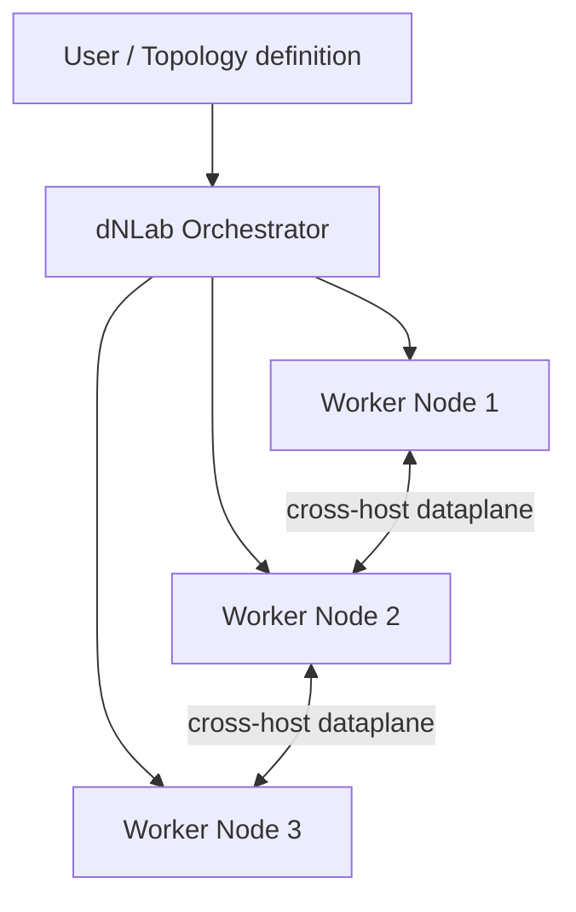

# dNLab

<p align="center">
  
</p>

> Build network labs that span multiple nodes, orchestrated automatically and transparently.


## Overview

**dNLab** (distributed Network Labs) is an application built around a [Containerlab](https://containerlab.dev) core. It lets you build network labs that are automatically distributed across multiple nodes, so a single topology can grow well beyond the capacity of one machine.

Orchestration is fully automatic and transparent. You design the topology; dNLab handles distributing and managing it across the underlying multi-node infrastructure — including device placement and scheduling, intra-host links, and cross-host dataplane connectivity. The distribution layer stays out of your way: you reason about the network you want, not the hosts it runs on.

dNLab is built for learning and experimenting with networking. Labs can be shared and interconnected, and a dedicated Role-Based Access Control (RBAC) system defines roles and permissions to make collaboration between users straightforward.

## Host Requirements

Recommended baseline:

- Debian 13 "trixie" official stable, minimal server install, `amd64`.
- Bare metal host with direct access to physical CPU, memory, storage and
  networking resources.
- One or more bare metal nodes are the reference architecture.
- As an alternative, one or more Proxmox LXC containers may be used when they
  are configured to expose the required host resources and privileges.
- Virtual machines are not a supported reference architecture for dNLab. dNLab
  is effective and efficient only when it can operate close to physical
  resources, especially for nested container, networking and virtual device
  workloads.
- Docker Engine 29.x stable from Docker's official Debian repository.
- Docker Compose plugin installed through the official Docker packages.
- systemd, cgroup v2 and the stock Debian 13 kernel.
- Local Docker storage on a reliable ext4 or xfs filesystem.
- [ContainerLab](https://containerlab.dev) installed.
- Root or sudo access for Docker, ContainerLab and host networking.
- Public inbound access only to the proxy ports, normally 80/443.

Use the Docker packages from Docker's repository, not the generic Debian
`docker.io` package. Record the output of `docker version` and
`docker compose version` before deploying a dNLab stack.

References:

- Debian 13 release notes: <https://www.debian.org/releases/trixie/release-notes/>
- Docker Engine on Debian: <https://docs.docker.com/engine/install/debian/>
- Docker Engine 29 release notes: <https://docs.docker.com/engine/release-notes/29/>

### Suggested multinode reference design

<p align="center">
  
</p>

## Docker Distribution Stack

This repository contains the Docker distribution stack for dNLab. It uses GHCR
image references and keeps application component source code in the separate
source repositories.

The stack contains:

- `dnlab-proxy`: Apache reverse proxy, exposed on the host.
- `dnlab-gui`: FastAPI GUI, internal only.
- `dnlab-multinode`: internal API for orchestration.
- `dnlab-lab-cleanup`: periodic stale-artifact reconciler, built from a
  dedicated slim image (`Dockerfile.cleanup`) and operating entirely over SSH.
- `dnlab-image-build`: internal API for image-build jobs and log streaming.
- `dnlab-auth-db`: support Postgres service for GUI local-db auth.

## Quick Start

Prepare host directories and configuration:

```bash
sudo mkdir -p /etc/dnlab /root/dnlab-topologies \
  /var/lib/docker/dnlab-backups /var/log/dnlab-gui \
  /var/log/dnlab-multinode /var/lib/dnlab-image-build /opt/vrnetlab
```

Create `/etc/dnlab/hosts.yml` and `/etc/dnlab/paths.yml` for your site before
deploying real labs. The GUI and the internal services mount `/etc/dnlab`
read-only.

Start the stack:

```bash
cp .env.example .env
# Edit .env and set a non-default POSTGRES_PASSWORD.
docker compose -f compose.yml up -d dnlab-proxy
```

Run the initial smoke check:

```bash
./smoke.sh
```

The default public URL is `http://localhost:8088`.

In this distribution stack the GUI, multinode and lab-cleanup services default
to the GHCR images selected by `DNLAB_IMAGE_PREFIX` and `DNLAB_IMAGE_TAG`.

## Documentation

- [USER_GUIDE.md](USER_GUIDE.md): browser workflows for lab users.
- [ADMIN_GUIDE.md](ADMIN_GUIDE.md): platform administration guide.
- [OPERATIONS.md](OPERATIONS.md): production-oriented runbook covering fresh
  install, TLS mode, production hardening, upgrade, backups and smoke checks.
- [CONTRIBUTING.md](CONTRIBUTING.md): contribution process and DCO
  requirements.
- [THIRD_PARTY_NOTICES.md](THIRD_PARTY_NOTICES.md): third-party notices and
  redistribution notes.
- [DCO](DCO): Developer Certificate of Origin text.
- [LICENSE](LICENSE): AGPL-3.0-or-later license text.

## Docker Auth Database

The DB image is the stock `postgres:16-alpine` image. It must not contain a
production DB dump. A fresh install starts with an empty named volume; on GUI
startup the compose command runs `alembic upgrade head` against that empty DB.

To seed the first local-db admin user:

```bash
DNLABGUI_BOOTSTRAP_ADMIN_USERNAME=admin \
DNLABGUI_BOOTSTRAP_ADMIN_PASSWORD='<one-time-password>' \
docker compose -f compose.yml --profile seed-admin run --rm dnlab-auth-seed
```

Migrating an existing auth DB is an operator procedure for a specific
environment, not a build step. First dump the old DB and keep a backup of the
target DB:

```bash
mkdir -p auth-db-dumps
docker exec <old-postgres-container> sh -lc \
  'PGPASSWORD="$POSTGRES_PASSWORD" pg_dump -U "$POSTGRES_USER" -d "$POSTGRES_DB" --no-owner --no-privileges' \
  > auth-db-dumps/dnlab_auth_from_old_container.sql

docker compose -f compose.yml exec -T dnlab-auth-db sh -lc \
  'PGPASSWORD="$POSTGRES_PASSWORD" pg_dump -U "$POSTGRES_USER" -d "$POSTGRES_DB" --no-owner --no-privileges' \
  > auth-db-dumps/dnlab_auth_compose_before_restore.sql
```

Then stop the GUI and restore the dump:

```bash
docker compose -f compose.yml stop dnlab-gui
docker compose -f compose.yml exec -T dnlab-auth-db sh -lc \
  'PGPASSWORD="$POSTGRES_PASSWORD" psql -U "$POSTGRES_USER" -d "$POSTGRES_DB" -v ON_ERROR_STOP=1 -c "drop schema public cascade; create schema public;"'
docker compose -f compose.yml exec -T dnlab-auth-db sh -lc \
  'PGPASSWORD="$POSTGRES_PASSWORD" psql -U "$POSTGRES_USER" -d "$POSTGRES_DB" -v ON_ERROR_STOP=1' \
  < auth-db-dumps/dnlab_auth_from_old_container.sql
docker compose -f compose.yml up -d dnlab-proxy
```

## Docker Service Boundaries

The compose file intentionally exposes only `dnlab-proxy`. The GUI talks to
`dnlab-multinode` through `DNLAB_MULTINODE_API_URL`; local Python fallback stays
available in the codebase but is not the target path for this stack. The Docker
GUI image does not install the `dnlab-multinode` Python package; if a GUI path
falls back to local orchestrator imports inside this stack, treat it as a
regression.

Local GUI fallbacks are kept only for standalone development outside Docker.
Inside this stack, `DNLAB_MULTINODE_API_URL` and `DNLAB_IMAGE_BUILD_API_URL` are
mandatory service boundaries.

The Docker network is project-scoped by Compose. This keeps ad-hoc fresh-install
checks with `docker compose -p <name>` isolated from the main stack.

The GUI container does not mount `/var/run/docker.sock`. Docker image discovery
is routed through `dnlab-multinode`; image-build operations are routed through
`dnlab-image-build`.

## Docker Validation

Fresh-install smoke check:

```bash
mkdir -p /tmp/dnlab-fresh-topologies
POSTGRES_PASSWORD=fresh-check-password \
DNLAB_PROXY_HTTP_PORT=18088 \
DNLAB_TOPOLOGIES_DIR=/tmp/dnlab-fresh-topologies \
docker compose -p dnlabfresh -f compose.yml up -d dnlab-proxy

POSTGRES_PASSWORD=fresh-check-password \
DNLAB_PROXY_HTTP_PORT=18088 \
DNLAB_TOPOLOGIES_DIR=/tmp/dnlab-fresh-topologies \
DNLABGUI_BOOTSTRAP_ADMIN_USERNAME=freshadmin \
DNLABGUI_BOOTSTRAP_ADMIN_PASSWORD='<freshadmin-password>' \
docker compose -p dnlabfresh -f compose.yml --profile seed-admin run --rm dnlab-auth-seed

curl -i http://127.0.0.1:18088/api/auth/login \
  -H 'Content-Type: application/json' \
  -d '{"username":"freshadmin","password":"<freshadmin-password>"}'

docker compose -p dnlabfresh -f compose.yml down -v
```

Run `./smoke.sh` after startup or distribution changes. It checks that the proxy is
reachable, the GUI image does not install or import `dnlab-multinode`, the GUI
does not mount the Docker socket, RealNet RR status goes through the API,
`hosts.yml` validation is served by `dnlab-multinode`, `dnlab_frr` resolves to
ContainerLab kind `linux`, and the lab-cleanup daemon has published state.

Run `./preflight.sh` to exercise a fresh install in an isolated Compose project
with an empty DB, first-admin bootstrap and login through the proxy.

## Docker Operations

The lab cleanup reconciler runs as its own Compose service and writes state to
`${DNLAB_LAB_CLEANUP_STATE_DIR:-/var/lib/dnlab-lab-cleanup}`. During first
rollout, set `lab_cleanup.dry_run: true` in `/etc/dnlab/hosts.yml`, inspect
the report, then switch it to `false` when ready:

```bash
docker compose -f compose.yml exec dnlab-lab-cleanup \
  dnlab-lab-cleanup sync --dry-run --json

docker compose -f compose.yml exec dnlab-lab-cleanup \
  dnlab-lab-cleanup sync --execute --json
```

The image-build service exposes an internal API at `http://dnlab-image-build:8082`.
Job metadata and logs are stored under
`${DNLAB_IMAGE_BUILD_WORKSPACE:-/var/lib/dnlab-image-build}` so they survive a
service restart. Jobs that were `queued` or `running` during a restart are
reloaded as failed with an interruption log line.

TLS proxy profile:

```bash
DNLAB_PROXY_SERVER_NAME=dnlab.example.com \
DNLAB_PROXY_WEBUI_SUFFIX=dnlab.example.com \
DNLABGUI_ALLOWED_ORIGINS=https://dnlab.example.com \
DNLABGUI_WEBUI_HOST_SUFFIX=dnlab.example.com \
DNLAB_PROXY_TLS_DIR=/etc/ssl/dnlab \
docker compose -f compose.yml -f compose.tls.yml up -d --force-recreate dnlab-gui dnlab-proxy
```

The TLS directory must contain the certificate and key referenced by
`DNLAB_PROXY_CERT_FILE` and `DNLAB_PROXY_CERT_KEY_FILE`, defaulting to
`/etc/ssl/dnlab/dnlab-gui.crt` and `/etc/ssl/dnlab/dnlab-gui.key` inside the
proxy container. Wildcard WebUI needs DNS and certificate coverage for both the
GUI hostname and `*.${DNLAB_PROXY_WEBUI_SUFFIX}`. The `compose.tls.yml`
override requires `DNLABGUI_ALLOWED_ORIGINS` and `DNLABGUI_WEBUI_HOST_SUFFIX`
so WebSocket origin checks and wildcard WebUI URLs match the browser-facing
hostname.

Production hardening profile:

```bash
DNLAB_PROXY_SERVER_NAME=dnlab.example.com \
DNLAB_PROXY_WEBUI_SUFFIX=dnlab.example.com \
DNLABGUI_ALLOWED_ORIGINS=https://dnlab.example.com \
DNLABGUI_WEBUI_HOST_SUFFIX=dnlab.example.com \
DNLAB_PROXY_TLS_DIR=/etc/ssl/dnlab \
docker compose -f compose.yml -f compose.tls.yml -f compose.hardened.yml up -d --force-recreate dnlab-gui dnlab-proxy
```

The hardening override makes the GUI root filesystem read-only, drops GUI Linux
capabilities, adds tmpfs for transient paths and applies `no-new-privileges` to
GUI, proxy, auth DB and image-build. `dnlab-multinode` remains the privileged
orchestration boundary; `dnlab-image-build` keeps the Docker socket because
image builds require it.

## Key Features

- **Containerlab-based core** — leverages Containerlab for defining and running virtual network topologies.
- **Multi-node distribution** — a single lab can be spread automatically across multiple worker nodes.
- **Automatic, transparent orchestration** — placement, scheduling, and link management are handled for you; no manual host assignment required.
- **Lab sharing and interconnection** — share labs with other users and connect labs together.
- **RBAC-based collaboration** — built-in roles and permissions simplify teamwork on shared labs.
- **Persistent VD disks** — supported virtual devices can keep disk state under
  the configured persistence root and reuse it across redeploys.

CephFS-backed persistence is an experimental option and has not been validated
for production use. Treat it as a lab feature until it is explicitly tested in
your environment.

## Architecture

A user submits a topology to the dNLab orchestrator. The orchestrator schedules devices across the available worker nodes, wiring same-host links locally and stitching cross-host links over the dataplane, then manages the lab's lifecycle across the cluster.



## Use Cases

- **Self-study** — students build routing and switching labs that outgrow a single laptop or server.
- **Automation development** — engineers test network automation tooling against realistic, multi-device topologies.
- **Team labs** — a group shares a pool of nodes and collaborates on labs with scoped access via RBAC.
- **Interconnected scenarios** — separate labs are linked together to model larger, multi-domain networks.

## Getting Started

### Prerequisites

- A Containerlab-compatible environment on each node. <!-- [TODO: confirm minimum Containerlab version] -->
- Container runtime and the virtual network device images you intend to use.
- One or more Linux hosts to act as worker nodes. <!-- [TODO: confirm OS/kernel requirements] -->

### Installation

```bash
# [TODO: replace with the real installation steps]
git clone [TODO: repository URL]
cd dnlab
# [TODO: build / install command]
```

### Quick Start

```bash
# [TODO: replace with the real CLI invocation]
dnlab deploy [TODO: path/to/topology]
```

## Usage

Define a distributed lab and deploy it across your nodes:

```bash
# [TODO: replace with the real topology format and deploy syntax]
dnlab deploy ./labs/example/[TODO: topology-file]
```

<!-- [TODO: document the topology file format and the fields that control distribution] -->

## Collaboration & RBAC

dNLab includes a Role-Based Access Control system that governs who can view, modify, and run shared labs. Permissions are attached to roles, and roles are assigned to users, so a team can grant the right level of access — for example, read-only access to a shared lab versus full control — without managing permissions one user at a time.

<!-- [TODO: document the specific roles and the permissions each one grants] -->

## Contributing

Contributions are welcome. Please open an issue to discuss significant changes
before submitting a pull request.

All contributions must be submitted under `AGPL-3.0-or-later` and certified
with the Developer Certificate of Origin 1.1. See
[CONTRIBUTING.md](CONTRIBUTING.md) for details.

## License

dNLab is licensed under the GNU Affero General Public License v3.0 or later
(`AGPL-3.0-or-later`). See [LICENSE](LICENSE) for details.
