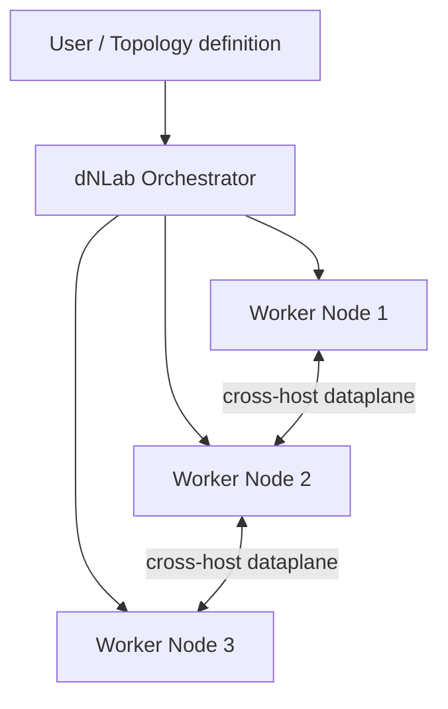

# dNLab

  

> Build network labs on one node or across many, orchestrated automatically and transparently.

## Overview

**dNLab** (distributed Network Labs) is an application that orchestrates [Containerlab](https://containerlab.dev) as an external runtime tool. It lets you build network labs on a single node or automatically distribute them across multiple nodes, so a topology can start small and grow beyond the capacity of one machine.

Orchestration is fully automatic and transparent. You design the topology; dNLab handles placing and managing it across the configured infrastructure — including single-host placement, device scheduling, intra-host links and cross-host dataplane connectivity when multiple workers are present. The distribution layer stays out of your way: you reason about the network you want, not the hosts it runs on.

dNLab is built for learning and experimenting with networking. Labs can be shared and interconnected, and a dedicated Role-Based Access Control (RBAC) system defines roles and permissions to make collaboration between users straightforward.

## Host Requirements

Recommended baseline:

- Debian 13 "trixie" official stable, minimal server install, `amd64`.
- Bare metal host with direct access to physical CPU, memory, storage and
  networking resources.
- One or more bare metal nodes are the reference architecture. A single host is
  a valid deployment model; in that case it acts as both master and worker.
- As an alternative, one or more Proxmox LXC containers may be used when they
  are configured to expose the required host resources and privileges.
- Virtual machines are not a supported reference architecture for dNLab. dNLab
  is effective and efficient only when it can operate close to physical
  resources, especially for nested container, networking and virtual device
  workloads.
- Docker Engine 29.x stable from Docker's official Debian repository.
- Docker Compose plugin installed through the official Docker packages.
- systemd, cgroup v2 and the stock Debian 13 kernel.
- Local Docker storage on a reliable ext4 or xfs filesystem.
- [Containerlab](https://containerlab.dev) installed.
- Root or sudo access for Docker, Containerlab and host networking.
- Public inbound access only to the proxy ports, normally 80/443.

Use the Docker packages from Docker's repository, not the generic Debian
`docker.io` package. Record the output of `docker version` and
`docker compose version` before deploying a dNLab stack.

References:

- Debian 13 release notes: <https://www.debian.org/releases/trixie/release-notes/>
- Docker Engine on Debian: <https://docs.docker.com/engine/install/debian/>
- Docker Engine 29 release notes: <https://docs.docker.com/engine/release-notes/29/>

For Proxmox deployments, see
[dNLab Proxmox LXC Template](docs/PROXMOX_LXC_TEMPLATE.md). Pull the ready-made
LXC template from GitHub Container Registry; it keeps secrets, TLS material and
site-specific host configuration out of the published archive.

### Suggested multinode reference design

  

## Docker Distribution Stack

This repository contains the Docker distribution stack for dNLab. It uses GHCR
image references and documents source availability for published images in
[SOURCE.md](docs/SOURCE.md).

Public release packages are published as `ghcr.io/scaci/dnlab-*` container
images and are linked to this public `scaci/dnlab` repository. The matching
AGPL source archives are attached to the corresponding GitHub Release.

Current release: `0.1.1`. The Compose stack requires `DNLAB_VERSION=0.1.1`
in `.env`; this selects the published GHCR images for the release.

The stack contains these Compose services:

- `proxy`: Apache reverse proxy, exposed on the host.
- `gui`: FastAPI GUI, internal only.
- `multinode`: internal API for orchestration.
- `lab-cleanup`: periodic stale-artifact reconciler, built from a
  dedicated slim image (`Dockerfile.cleanup`) and operating entirely over SSH.
- `image-build`: internal API for image-build jobs and log streaming.
- `image-sync`: internal image synchronization helper.
- `auth-db`: support Postgres service for GUI local-db auth.

Images, binaries, log directories, TLS files and source artifacts keep their
`dnlab-*` product names.

## Repository Layout

This repository is the canonical dNLab distribution source tree. Application
sources live under `src/`:

- `src/gui`: FastAPI GUI, static frontend, auth DB migrations and proxy assets.
- `src/multinode`: orchestration API, CLI, cleanup daemon and runtime helper
  image contexts.
- `src/image-build`: image-build API and vrnetlab patch helpers.

The root contains the distribution Compose files, release metadata and shared
documentation. Proxmox LXC template packaging is an internal release process;
the published template and Proxmox helper assets are distributed through GHCR
and the matching GitHub Release.

## Deployment

Installation and operational steps live in the administrator documentation:

- [ADMIN_GUIDE.md](docs/ADMIN_GUIDE.md): bare metal installation, host
  configuration, TLS, first administrator setup, validation, backup and upgrade.
- [dNLab Proxmox LXC Template](docs/PROXMOX_LXC_TEMPLATE.md): Proxmox LXC
  deployment from the published template.

In this distribution stack the GUI, multinode and lab-cleanup services default
to the GHCR images selected by `DNLAB_IMAGE_PREFIX` and `DNLAB_VERSION`.

## Documentation

- [USER_GUIDE.md](docs/USER_GUIDE.md): browser workflows for lab users.
- [ADMIN_GUIDE.md](docs/ADMIN_GUIDE.md): platform administration guide.
- [CONTRIBUTING.md](docs/CONTRIBUTING.md): contribution process and DCO
  requirements.
- [THIRD_PARTY_NOTICES.md](docs/THIRD_PARTY_NOTICES.md): third-party notices and
  redistribution notes.
- [DCO](DCO): Developer Certificate of Origin text.
- [LICENSE](LICENSE): AGPL-3.0-or-later license text.
- [LICENSE_FAQ.md](docs/LICENSE_FAQ.md): practical notes for on-premises use,
  AGPL obligations and commercial licensing.
- [SOURCE.md](docs/SOURCE.md): source availability policy for published dNLab
  container images.

## Key Features

- **Containerlab orchestration** — invokes Containerlab for defining and running virtual network topologies without being a fork of Containerlab.
- **Single-node or multi-node operation** — a lab can run on one host or be
  spread automatically across multiple worker nodes.
- **Automatic, transparent orchestration** — placement, scheduling, and link management are handled for you; no manual host assignment required.
- **Lab sharing and interconnection** — share labs with other users and connect labs together.
- **RBAC-based collaboration** — built-in roles and permissions simplify teamwork on shared labs.
- **Persistent VD disks** — supported virtual devices can keep disk state under
  the configured persistence root and reuse it across redeploys.

CephFS-backed persistence is an experimental option and has not been validated
for production use. Treat it as a lab feature until it is explicitly tested in
your environment.

## Architecture

A user submits a topology to the dNLab orchestrator. The orchestrator schedules
devices on the configured worker capacity, wiring same-host links locally and,
when multiple workers are present, stitching cross-host links over the
dataplane. The following diagram shows a multi-node deployment.

## Use Cases

- **Self-study** — students build routing and switching labs that outgrow a single laptop or server.
- **Automation development** — engineers test network automation tooling against realistic, multi-device topologies.
- **Team labs** — a group shares a pool of nodes and collaborates on labs with scoped access via RBAC.
- **Interconnected scenarios** — separate labs are linked together to model larger, multi-domain networks.

## Getting Started

Administrators should begin with [ADMIN_GUIDE.md](docs/ADMIN_GUIDE.md) for bare
metal installs or [PROXMOX_LXC_TEMPLATE.md](docs/PROXMOX_LXC_TEMPLATE.md)
for Proxmox LXC template deployments. End users should start with
[USER_GUIDE.md](docs/USER_GUIDE.md) after an administrator has provisioned the
platform.

## Usage

Open the GUI through the HTTPS proxy, seed the first administrator if this is a
fresh install, and create or import labs from the browser. The backend uses the
images selected by `DNLAB_VERSION`, `DNLAB_IMAGE_PREFIX` and
`DNLAB_RUNTIME_IMAGE_PREFIX`. Published GHCR images are the default install
path; local image builds from the application sources under `src/` are
documented in [ADMIN_GUIDE.md](docs/ADMIN_GUIDE.md).

## Collaboration & RBAC

dNLab includes a Role-Based Access Control system that governs who can view, modify, and run shared labs. Permissions are attached to roles, and roles are assigned to users, so a team can grant the right level of access — for example, read-only access to a shared lab versus full control — without managing permissions one user at a time.

## Contributing

Contributions are welcome. Please open an issue to discuss significant changes
before submitting a pull request.

All contributions must be submitted under `AGPL-3.0-or-later` and certified
with the Developer Certificate of Origin 1.1. See
[CONTRIBUTING.md](docs/CONTRIBUTING.md) for details.

## License

dNLab is licensed under the GNU Affero General Public License v3.0 or later
(`AGPL-3.0-or-later`). See [LICENSE](LICENSE) for details.

Internal on-premises use does not require publishing your modifications solely
because of that internal use. See [LICENSE_FAQ.md](docs/LICENSE_FAQ.md) for practical
notes on AGPL obligations and commercial licensing. See [SOURCE.md](docs/SOURCE.md)
for the source availability policy for published dNLab container images.
Third-party tools and packages keep their own licenses; see
[THIRD_PARTY_NOTICES.md](docs/THIRD_PARTY_NOTICES.md) for notice handling,
SBOM expectations and non-endorsement notes.
