# dNLab User Guide

This guide is for people who use the dNLab browser interface to create, run,
observe and share network labs. It assumes an administrator has already
deployed dNLab and created your account.

For platform setup and operations, see [ADMIN_GUIDE.md](ADMIN_GUIDE.md) and
[OPERATIONS.md](OPERATIONS.md).

## Sign In

Open the dNLab URL provided by your administrator. In a local default install
this may be `http://localhost:8088`; production deployments normally use a
site hostname such as `https://dnlab.example.com`.

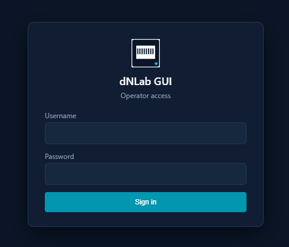

After login, dNLab opens the main application shell. Your account role controls
which actions are available.

## Labs View

The Labs view is the main workspace for building and operating topologies.

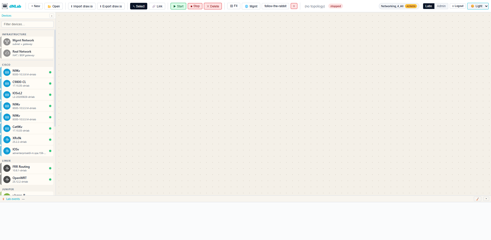

The interface is organized around:

- a toolbar for common actions such as new/open lab, import/export, link mode,
  start, stop, delete and fit;
- a device catalog/sidebar populated from available Docker images and the
  dNLab device catalog;
- a canvas where virtual devices, RealNet objects and links are arranged;
- a properties panel for selected devices, links, management settings and
  advanced options;
- a bottom area for console and log views;
- an event footer for long-running operations such as deploy, destroy, image
  sync, capture and path tracing.

## Create Or Open A Lab

Use the new-lab workflow to create a lab with a display name and description.
dNLab stores labs by UUID internally, so different users can use the same
display name without colliding at runtime.

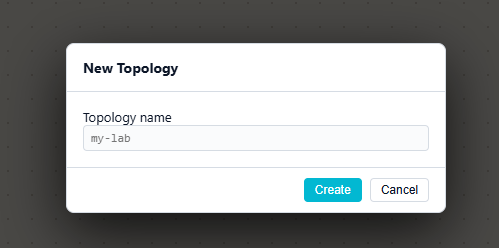

You can also open an existing lab from the lab list. Your role determines
whether you can edit it or only view it.

## Build A Topology

Add devices from the catalog to the canvas. The catalog provides device labels,
vendor grouping, icons, management interface defaults, resource defaults and
known Web UI metadata.

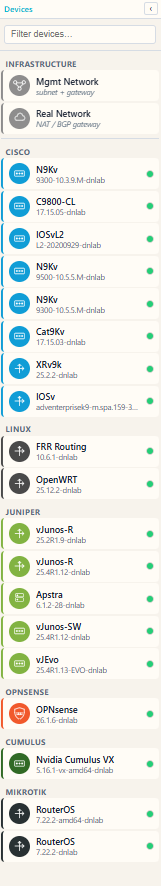

Create links by selecting endpoints on two devices. dNLab stores links as
logical `node:interface` pairs and translates the lab into Containerlab
resources during deployment.

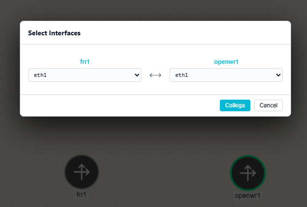

Use the properties panel to set the Docker image, management addresses, resource
overrides, advanced node options and device-specific features. Management IPv4
and IPv6 settings can be configured globally for the lab and, when needed, per
device.

## Import And Export draw.io

dNLab can export a lab to a `.drawio` file and import it later. Files exported
by recent dNLab versions preserve dNLab metadata such as GUI kind, image, link
interfaces, RealNet objects, Web UI settings and canvas positions.

External or older draw.io files are imported best effort. After import, review
the device kind, Docker image and interface choices before starting the lab.

## Start, Stop And Destroy Labs

When you start a lab, dNLab asks the orchestrator for a pre-deploy plan. Review
placement, image availability and warnings before confirming the start.

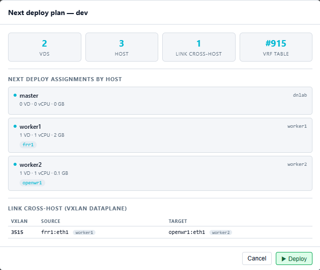

During deployment and teardown, the footer shows live events. A deployed lab has
active dNLab runtime infrastructure; each virtual device also has its own state
such as `running`, `stopped`, `starting`, `stopping` or `error`.

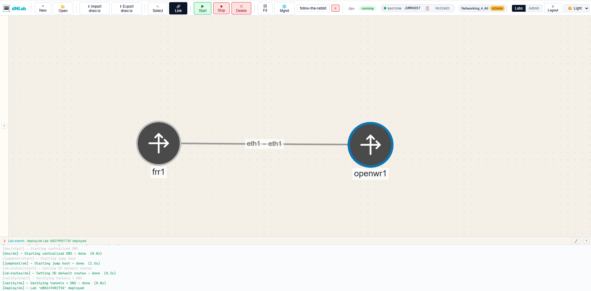

Use Stop or Destroy to tear down a lab when you are finished. Supported virtual
devices can keep persistent disk state on the dNLab storage root and reuse it
on later deploys. If you need to remove saved state for a supported device, use
the node wipe action only when you are sure the persistent disk is no longer
needed.

## Per-Device Actions

Open a device context menu to operate one virtual device without restarting the
whole lab.

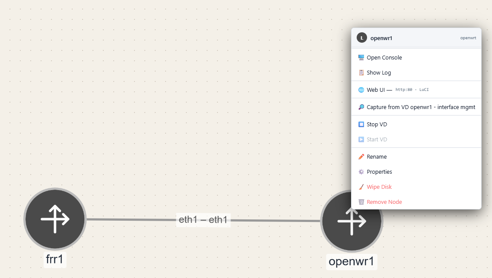

Common actions include:

- start or stop a single virtual device;
- reconcile a device when the backend supports live repair;
- open console or logs;
- open a device Web UI;
- start or stop packet capture;
- wipe persistent device data for supported kinds.

Infrastructure nodes such as `bridge`, `ovs-bridge` or `host` may not provide a
useful serial console.

## Device Web UI

Some device kinds expose HTTP or HTTPS management pages. dNLab opens these
through a per-device tunnel and the public proxy, so your browser reaches the
device without exposing internal Docker networks directly.

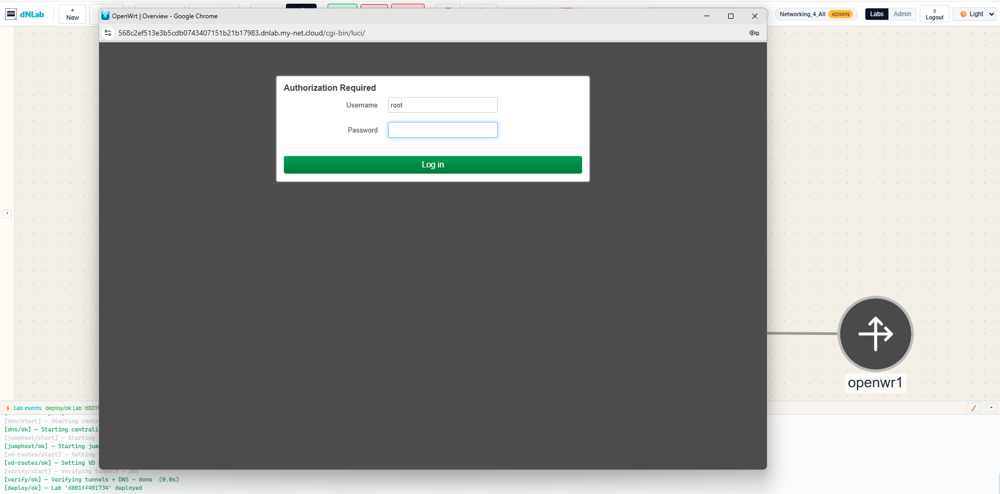

In production, administrators normally configure wildcard DNS and certificates
so hostnames under `*.dnlab.example.com` can route to device Web UIs.

## Console And Logs

The Console and Logs tabs let you inspect device runtime behavior from the
browser.

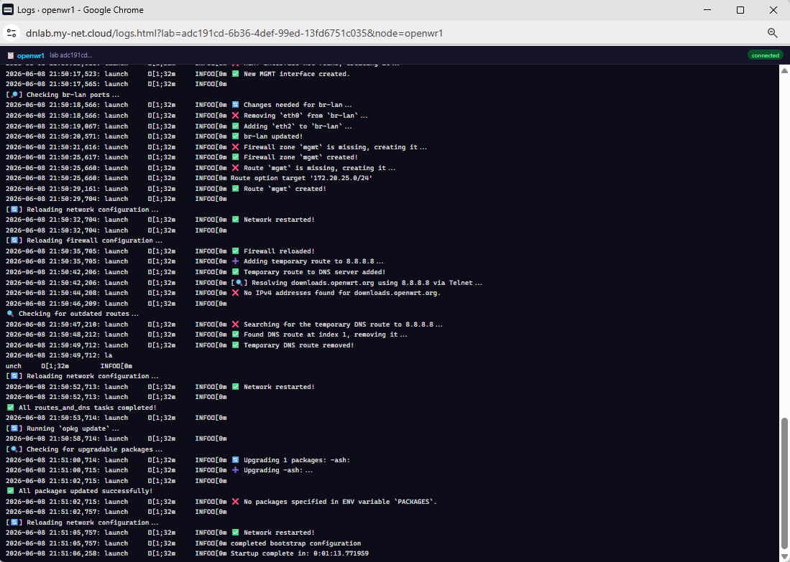

Console access is resolved through the dNLab runtime report and relay for the
host that runs the virtual device. Some virtual network devices take several
minutes before their console becomes responsive.

## Packet Capture

When capture is available for a link or interface, use the context menu to
launch or stop a capture session. dNLab validates the capture target, applies
controlled packet filters and streams packet data through a short-lived token.

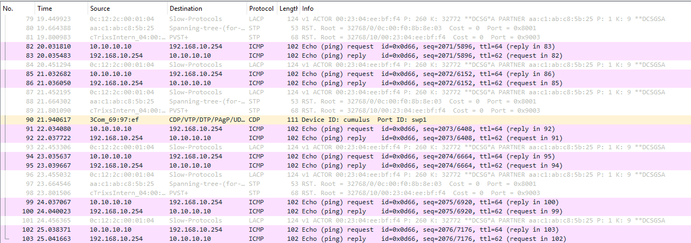

Your administrator may provide a desktop handler for opening captures in
Wireshark.

## Follow The Rabbit

Follow the Rabbit is a passive traffic-observation workflow. It correlates a
flow seen in captures and visualizes the oriented path on the canvas.

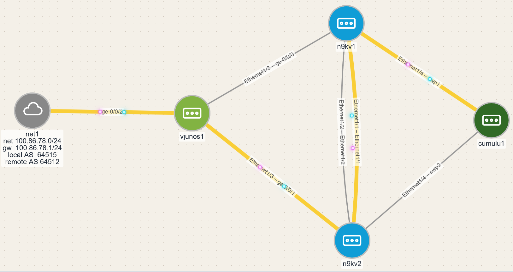

This feature observes existing traffic; it does not generate traffic for you.

## RealNet

RealNet objects model connectivity between a lab and external networks. A lab
may use simple NAT mode or BGP mode with administrator-managed route reflector
configuration. Device-side routing policy remains explicit: configure
neighbors, passwords and policies inside the virtual devices as required by the
scenario.

## Roles And Access

dNLab uses role-based access control:

- `admin`: full access to all labs and administrator areas.
- `graduate`: can manage own labs and student labs; read-only elsewhere.
- `assistant`: API-only automation role with graduate-like API permissions; it
  cannot use the browser GUI or browser Web UI access.
- `student`: can manage own labs; read-only elsewhere.
- `rookie`: read-only everywhere; cannot create or own labs.

If an action is hidden or rejected, your account probably does not have the
required role for that lab.

## Troubleshooting

- If login fails, check the username/password and contact an administrator if
  the account might be inactive.
- If a device image is missing, ask an administrator to check Docker image
  discovery, image sync or image-build.
- If a virtual device does not keep configuration after redeploy, confirm with
  an administrator that the image supports dNLab persistent disks and that the
  device configuration was saved inside the guest OS.
- If Start shows warnings, read the pre-deploy plan before continuing.
- If a device Web UI does not open, confirm the lab is deployed and the device
  is running; administrators should check wildcard DNS, TLS and proxy settings.
- If console is blank, wait for the virtual device to finish booting and try
  again.
- If a lab operation appears stuck, review the event footer and ask an
  administrator to run the smoke checks and inspect backend service health.
