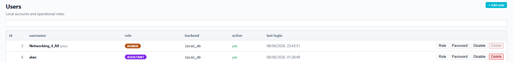
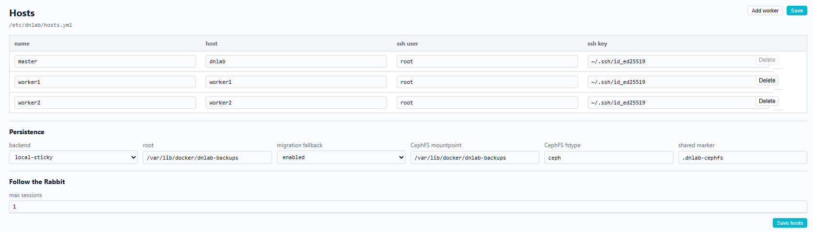
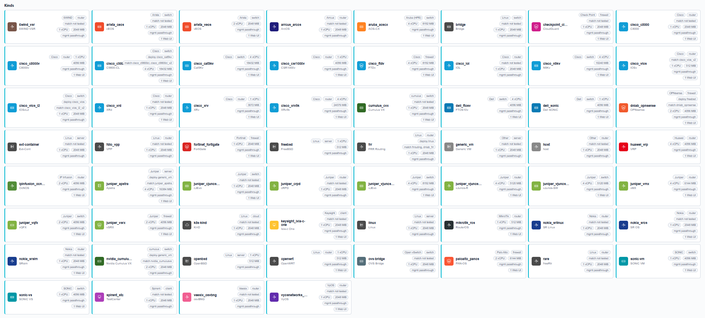
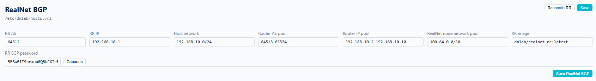
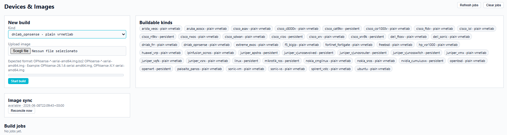

# dNLab Admin Guide

This guide is for administrators who deploy and operate the dNLab Docker
distribution stack. It is the authoritative guide for installation, TLS,
validation, hardening, upgrade, backup and release operations.

For end-user workflows in the browser, see [USER_GUIDE.md](USER_GUIDE.md).

## Architecture

dNLab exposes one public Compose service, `proxy`, on the host. The GUI and
backend services stay on the internal Compose network.

Main Compose services:

- `proxy`: Apache reverse proxy for HTTP, TLS, WebSocket and per-device
  Web UI access.
- `gui`: FastAPI GUI and browser application.
- `multinode`: internal orchestration API for Containerlab, workers and
  runtime state.
- `image-sync`: internal image synchronization helper.
- `lab-cleanup`: periodic reconciler for stale runtime artifacts.
- `image-build`: internal API for image-build jobs and logs.
- `auth-db`: PostgreSQL database for local authentication.

Images, binaries, log directories, TLS files and source artifacts keep their
`dnlab-*` product names.

The GUI container does not mount `/var/run/docker.sock`; Docker discovery and
orchestration flow through the internal services.

## Host Prerequisites

Use Linux hosts suitable for nested container, network and virtual-device
workloads. The reference baseline is Debian 13 on bare metal with Docker Engine
from Docker's official repository, Docker Compose plugin, Containerlab, cgroup
v2 and root or sudo access for host networking operations.

Expose only proxy ports to users, normally 80 and 443 in production.

## Host Configuration

dNLab expects shared host configuration under `/etc/dnlab`.

Required files:

- `/etc/dnlab/hosts.yml`: master and worker host inventory.
- `/etc/dnlab/paths.yml`: shared paths used by GUI and backend services.

The `master` entry identifies the host that runs the Compose stack and
orchestration services. Worker entries identify hosts that can run lab devices.
For a single-node installation, the same host acts as both master and worker;
use the Docker-network gateway address that containers can use to reach the
host SSH daemon, and omit remote workers. Do not use `localhost` here: inside
the dNLab containers it refers to the container itself, not to the Docker host.
For example, if the `dnlab_dnlab-internal` gateway is `172.18.0.1`:

```yaml
infrastructure:
  master:
    host: 172.18.0.1
    ssh_user: root
  workers: {}
```

The gateway address is installation-specific. Confirm it with Docker before
writing `hosts.yml`, for example by inspecting the dNLab internal network after
it exists:

```bash
docker network inspect dnlab_dnlab-internal --format '{{(index .IPAM.Config 0).Gateway}}'
```

For a multi-node installation, use a dedicated network for cross-host lab
dataplane traffic whenever possible, and declare the selected interface alias
for every host in `hosts.yml`. The alias should refer to the intended
multinode/dataplane fabric, not to an incidental management interface, unless
the site intentionally shares those networks. A minimal inventory shape is:

```yaml
infrastructure:
  master:
    host: dnlab-master.example.com
    ssh_user: root
    interface: fabric0
  workers:
    worker1:
      host: dnlab-worker1.example.com
      ssh_user: root
      interface: fabric0
```

Replace `interface` with the exact interface-alias key used by your deployed
dNLab inventory schema if it differs, and replace `fabric0` with the site-local
alias for the dedicated dataplane interface.

`/etc/dnlab/paths.yml` uses top-level keys. Do not wrap the values in `paths:`
or `persistence:` sections:

```yaml
hosts_file: /etc/dnlab/hosts.yml
image_sync_state: /var/lib/dnlab-image-sync/state.json
persist_root: /var/lib/docker/dnlab-backups
topologies_dir: /root/dnlab-topologies
ssh_key: /root/.ssh/id_ed25519_github_dnlab
ssh_gui_key: /root/.ssh/dnlab-gui.key
log_dir_multinode: /var/log/dnlab-multinode
log_dir_gui: /var/log/dnlab-gui
tmp_dir: /tmp
containerlab_bin: /usr/bin/containerlab
docker_socket: unix:///var/run/docker.sock
```

`ssh_key` is the master-to-worker orchestration key used by backend services.
`ssh_gui_key` is the GUI-to-jumphost key used for Web UI, console and log
tunnels.

Common host directories:

```bash
sudo mkdir -p /etc/dnlab /root/dnlab-topologies \
  /var/lib/docker/dnlab-backups /var/log/dnlab-gui \
  /var/log/dnlab-multinode /var/lib/dnlab-image-build /opt/vrnetlab
```

`/opt/vrnetlab` must contain the dNLab vrnetlab tree used by
the `image-build` service. For a fresh host:

```bash
if [ ! -d /opt/vrnetlab/.git ]; then
  sudo git clone --branch dnlab https://github.com/scaci/vrnetlab.git /opt/vrnetlab
else
  git -C /opt/vrnetlab remote -v
  git -C /opt/vrnetlab branch --show-current
fi
```

The Compose stack mounts `/etc/dnlab` read-only into the GUI and internal
services.

Prepare SSH from the same point of view used by the containers. For manual
installs, create the dedicated keypair on the master and keep the private key
there:

```bash
install -d -m 0700 /root/.ssh
test -f /root/.ssh/id_ed25519_github_dnlab || \
  ssh-keygen -t ed25519 -N '' \
    -f /root/.ssh/id_ed25519_github_dnlab \
    -C "dnlab@$(hostname)"
chmod 0600 /root/.ssh/id_ed25519_github_dnlab
```

Install `/root/.ssh/id_ed25519_github_dnlab.pub` in
`/root/.ssh/authorized_keys` on every host declared in `hosts.yml`, including
the configured master target for master-to-master access. For remote workers,
`ssh-copy-id -i /root/.ssh/id_ed25519_github_dnlab.pub root@<worker-host>` is
acceptable when available. For single-node installs, `master.host` should be
reachable from the `multinode` service over SSH. Because `/root/.ssh` is mounted
read-only inside the containers, add the configured master and worker host keys
to `/root/.ssh/known_hosts` on the host before starting the stack. Some RealNet
paths may still look for
`/root/.ssh/id_ed25519`; if you use a dedicated key in `paths.yml`, provide a
controlled alias, symlink or copy at the default key path with the same
permissions as the source key.

Create the dedicated keypair declared as `ssh_gui_key` in `paths.yml`. The GUI
uses it to reach per-lab jumphost containers for Web UI, console and log
tunnels:

```bash
test -f /root/.ssh/dnlab-gui.key || \
  ssh-keygen -t ed25519 -N '' \
    -f /root/.ssh/dnlab-gui.key \
    -C "dnlab@$(hostname)"
chmod 0600 /root/.ssh/dnlab-gui.key
```

## Environment File

Create `.env` from `.env.example` and set a strong database password before
starting the stack. At minimum, set:

```text
DNLAB_VERSION=0.1.1
POSTGRES_PASSWORD=<long random value>
DNLAB_PROXY_SERVER_NAME=<gui-hostname>
DNLAB_PROXY_HTTPS_PORT=<https-port>
DNLAB_PROXY_TLS_DIR=<host TLS directory>
DNLABGUI_ALLOWED_ORIGINS=https://<gui-origin>
```

TLS is always enabled by the base Compose file. For a local self-signed test,
`localhost` and port `8443` are acceptable:

```text
DNLAB_PROXY_SERVER_NAME=localhost
DNLAB_PROXY_HTTPS_PORT=8443
DNLAB_PROXY_TLS_DIR=/etc/ssl/dnlab
DNLABGUI_ALLOWED_ORIGINS=https://localhost:8443
```

Important settings:

- `DNLAB_VERSION`: image tag. For this release, use `DNLAB_VERSION=0.1.1`.
- `DNLAB_IMAGE_PREFIX`: image registry prefix, normally `ghcr.io/scaci/`.
- `DNLAB_RUNTIME_IMAGE_PREFIX`: runtime image prefix, normally
  `ghcr.io/scaci/dnlab-`.
- `POSTGRES_DB`, `POSTGRES_USER`, `POSTGRES_PASSWORD`: auth DB settings.
- `DNLAB_PROXY_HTTP_PORT`: public HTTP port used for ACME challenge and HTTP-to-HTTPS redirect.
- `DNLAB_PROXY_SERVER_NAME`: public GUI hostname; also drives Apache wildcard aliases and the GUI Web UI suffix.
- `DNLABGUI_ALLOWED_ORIGINS`: browser-facing origin for CORS and WebSocket
  origin checks.
- `DNLAB_TOPOLOGIES_DIR`, `DNLAB_PERSIST_ROOT`, `DNLAB_LOG_DIR_GUI`,
  `DNLAB_LOG_DIR_MULTINODE`, `DNLAB_IMAGE_BUILD_WORKSPACE`: host-side storage
  and log directories.

Do not keep real bootstrap admin passwords in `.env`; export them only for the
single seed command.

## First Install

### Install Docker And Containerlab Prerequisites

Use this prerequisite path for manual bare-metal installations and for worker
hosts prepared outside the Proxmox LXC template. The published Proxmox LXC
template already preinstalls these packages.

The reference package baseline matches the dNLab template builder: Debian
13/Trixie on `amd64`, Docker Engine from Docker's official Debian repository,
the Docker Compose plugin from the Docker packages, and Containerlab from the
NetDevOps Fury APT repository.

Install the base APT tools first:

```bash
apt-get update
apt-get install -y --no-install-recommends \
  ca-certificates \
  curl \
  gnupg
```

Add Docker's official Debian repository and install Docker Engine, containerd,
Buildx and the Compose plugin:

```bash
install -d -m 0755 /etc/apt/keyrings
curl -fsSL https://download.docker.com/linux/debian/gpg \
  -o /etc/apt/keyrings/docker.asc
chmod 0644 /etc/apt/keyrings/docker.asc
cat >/etc/apt/sources.list.d/docker.list <<'EOF'
deb [arch=amd64 signed-by=/etc/apt/keyrings/docker.asc] https://download.docker.com/linux/debian trixie stable
EOF

apt-get update
apt-get install -y --no-install-recommends \
  containerd.io \
  docker-buildx-plugin \
  docker-ce \
  docker-ce-cli \
  docker-compose-plugin
```

Add the Containerlab APT repository and install Containerlab:

```bash
cat >/etc/apt/sources.list.d/netdevops.list <<'EOF'
deb [trusted=yes] https://netdevops.fury.site/apt/ /
EOF

apt-get update
apt-get install -y --no-install-recommends containerlab
```

Enable and verify Docker, then record the installed tool versions before
deploying the dNLab stack:

```bash
systemctl enable --now docker
systemctl status docker
docker version
docker compose version
containerlab version
```

### Bare Metal Install

Use this path when installing the Docker distribution directly on one or more
Linux hosts. Bare metal remains the reference deployment model.

1. Prepare `/etc/dnlab/hosts.yml`, `/etc/dnlab/paths.yml` and the host
   directories. For a single-node install, set `master.host` to the
   Docker-network gateway address reachable from containers, such as
   `172.18.0.1` in an installation where that is the dNLab internal-network
   gateway, and leave `workers` empty. For a multi-node install, declare the
   dedicated dataplane interface alias for the master and every worker.
2. Install or verify the dNLab vrnetlab tree at `/opt/vrnetlab`; it is used by
   the `image-build` service and should be the `dnlab` branch of
   `https://github.com/scaci/vrnetlab.git`.
3. Configure SSH key-based access from the master to every host in
   `hosts.yml`. Generate `/root/.ssh/id_ed25519_github_dnlab` if needed,
   install its public key in `/root/.ssh/authorized_keys` on the configured
   master target and every worker, and keep the private key only on the master.
   Validate access with a non-interactive command such as
   `ssh -o BatchMode=yes root@<master.host> true` and repeat for every worker
   before starting installation. Also ensure the configured master and worker
   host keys are already present in `/root/.ssh/known_hosts`.
4. Generate `/root/.ssh/dnlab-gui.key` if needed and set
   `ssh_gui_key: /root/.ssh/dnlab-gui.key` in `/etc/dnlab/paths.yml`; the GUI
   uses this key for Web UI, console and log tunnels through jumphost
   containers.
5. Install a TLS certificate for the proxy. For a local test, a self-signed
   certificate under `/etc/ssl/dnlab` is acceptable; production should use a
   publicly trusted certificate.

```bash
mkdir -p /etc/ssl/dnlab
openssl req -x509 -nodes -newkey rsa:2048 -days 365 \
  -keyout /etc/ssl/dnlab/dnlab-gui.key \
  -out /etc/ssl/dnlab/dnlab-gui.crt \
  -subj "/CN=localhost" \
  -addext "subjectAltName=DNS:localhost,IP:127.0.0.1"
```

6. Copy `.env.example` to `.env`; set `POSTGRES_PASSWORD`,
   `DNLAB_PROXY_SERVER_NAME`, `DNLAB_PROXY_HTTPS_PORT`,
   `DNLAB_PROXY_TLS_DIR` and `DNLABGUI_ALLOWED_ORIGINS`.
7. Public release images are readable without registry login. If the deployment
   uses a private mirror, authenticate Docker to that registry first; Git SSH
   access to the repository is separate from Docker registry access.
8. Pull the full published GHCR image set, then start the proxy dependency
   chain:

```bash
docker compose -f compose.yml --profile release-images pull
docker compose -f compose.yml up -d proxy
```

Use `--profile release-images` only for `pull`. It includes runtime images
such as jumphost, DNS, RealNet and management-anchor helpers that are created
later by lab orchestration; it is not part of the normal `up` command.

9. Run `./smoke.sh` against the HTTPS URL. For a self-signed local test:

```bash
COMPOSE_FILES=compose.yml \
DNLAB_SMOKE_PROXY_URL=https://localhost:8443/ \
DNLAB_SMOKE_CURL_INSECURE=1 \
./smoke.sh
```

10. Seed the first administrator:

```bash
DNLABGUI_BOOTSTRAP_ADMIN_USERNAME=admin \
DNLABGUI_BOOTSTRAP_ADMIN_PASSWORD='<one-time-password>' \
docker compose -f compose.yml --profile seed-admin run --rm auth-seed
```

11. Run the HTTPS smoke check again.

### Bare Metal Install From Local Sources

Use this path when the host should build the dNLab Docker images from the
monorepo sources instead of pulling the published GHCR images. Keep the same
host preparation, SSH, TLS, `.env`, vrnetlab and validation steps from the
bare-metal install above.

Application sources live under `/opt/dnlab/src`:

- GUI: `/opt/dnlab/src/gui`
- proxy: `/opt/dnlab/src/gui/deploy/apache/Dockerfile`
- multinode API and image-sync: `/opt/dnlab/src/multinode`
- lab-cleanup: `/opt/dnlab/src/multinode/Dockerfile.cleanup`
- image-build: `/opt/dnlab/src/image-build`
- runtime helper images:
  `/opt/dnlab/src/multinode/{jumphost,dns,runtime-relay,realnet-router,realnet-rr,mgmt-anchor}`

Use a local tag and prefixes that still match `compose.yml` image names:

```text
DNLAB_VERSION=local
DNLAB_IMAGE_PREFIX=dnlab-local/
DNLAB_RUNTIME_IMAGE_PREFIX=dnlab-local/dnlab-
```

Build the application images:

```bash
cd /opt/dnlab
docker build -t dnlab-local/dnlab-gui:local -f src/gui/Dockerfile src/gui
docker build -t dnlab-local/dnlab-proxy:local -f src/gui/deploy/apache/Dockerfile src/gui
docker build -t dnlab-local/dnlab-multinode:local -f src/multinode/Dockerfile src/multinode
docker build -t dnlab-local/dnlab-lab-cleanup:local -f src/multinode/Dockerfile.cleanup src/multinode
docker build -t dnlab-local/dnlab-image-build:local -f src/image-build/Dockerfile src/image-build
```

Build the runtime helper images used later by lab orchestration:

```bash
docker build -t dnlab-local/dnlab-jumphost:local -f src/multinode/jumphost/Dockerfile src/multinode/jumphost
docker build -t dnlab-local/dnlab-dns:local -f src/multinode/dns/Dockerfile src/multinode/dns
docker build -t dnlab-local/dnlab-runtime-relay:local -f src/multinode/runtime-relay/Dockerfile src/multinode/runtime-relay
docker build -t dnlab-local/dnlab-realnet-router:local -f src/multinode/realnet-router/Dockerfile src/multinode/realnet-router
docker build -t dnlab-local/dnlab-realnet-rr:local -f src/multinode/realnet-rr/Dockerfile src/multinode/realnet-rr
docker build -t dnlab-local/dnlab-mgmt-anchor:local -f src/multinode/mgmt-anchor/Dockerfile src/multinode/mgmt-anchor
```

After the images exist locally, start the same Compose stack without the
release-image pull step:

```bash
docker compose -f compose.yml up -d proxy
COMPOSE_FILES=compose.yml \
DNLAB_SMOKE_PROXY_URL=https://localhost:8443/ \
DNLAB_SMOKE_CURL_INSECURE=1 \
./smoke.sh
```

When a dedicated local-build Compose override is present, use it only as a
shorter way to build the same image names and tags; `compose.yml` remains the
runtime source of truth.

### Proxmox LXC Template Install

Use this path when deploying from the published template documented in
[dNLab Proxmox LXC Template](PROXMOX_LXC_TEMPLATE.md). The template is
pulled from GitHub Container Registry, preinstalls host prerequisites and runs
an idempotent first-boot configurator.

1. Prepare the Proxmox host and CT config as described in the template guide:
   boot the Proxmox node with `loop.max_loop=64`, create a Proxmox LXC CT, and
   apply the dNLab raw-device tuning to `/etc/pve/lxc/<CTID>.conf` with
   `apply-proxmox-ct-tuning.sh <CTID>` or the documented manual block.
2. Let `dnlab-firstboot.service` complete. It creates `.env`, generates a
   local database password, writes `/etc/dnlab/hosts.yml` and
   `/etc/dnlab/paths.yml`, generates the orchestration and GUI-jumphost SSH
   keys, creates a local self-signed TLS certificate and starts the proxy.
3. Run `dnlab-configure-env` inside the CT, or update `/opt/dnlab/.env`
   manually, for the site hostname, public HTTPS port, certificate directory
   and browser origin:
   `DNLAB_PROXY_SERVER_NAME`, `DNLAB_PROXY_HTTPS_PORT`,
   `DNLAB_PROXY_TLS_DIR` and `DNLABGUI_ALLOWED_ORIGINS`.
4. Replace the generated self-signed certificate with a site certificate before
   production use. Keep the certificate and key names aligned with
   `DNLAB_PROXY_CERT_FILE` and `DNLAB_PROXY_CERT_KEY_FILE`; the guided
   configurator can generate a new local self-signed certificate for test
   deployments.
5. Verify `/etc/dnlab/hosts.yml` and `/etc/dnlab/paths.yml`. The generated
   `paths.yml` should include both
   `ssh_key: /root/.ssh/id_ed25519_github_dnlab` and
   `ssh_gui_key: /root/.ssh/dnlab-gui.key`.
6. Optionally preload runtime helper images with
   `docker compose -f compose.yml --profile release-images pull`; use that
   profile for pulls only.
7. Seed the first administrator and run `./smoke.sh` against the CT HTTPS URL
   as described in the LXC template guide.

## TLS And Wildcard Web UI

TLS is built into `compose.yml`; `compose.tls.yml` remains only as a no-op
compatibility file for older commands and should not be treated as an active
override.

```bash
DNLAB_PROXY_SERVER_NAME=dnlab.example.com \
DNLABGUI_ALLOWED_ORIGINS=https://dnlab.example.com \
DNLAB_PROXY_TLS_DIR=/etc/ssl/dnlab \
docker compose -f compose.yml up -d --force-recreate gui proxy
```

`DNLAB_PROXY_SERVER_NAME` is the single public-host setting for the proxy and
GUI. Compose derives Apache wildcard aliases and the GUI Web UI suffix from it.
The TLS directory is mounted inside the proxy container as `/etc/ssl/dnlab`.
It must contain the certificate and key referenced by `DNLAB_PROXY_CERT_FILE`
and `DNLAB_PROXY_CERT_KEY_FILE`.

Verify the proxy after TLS changes:

```bash
docker compose -f compose.yml exec -T proxy apache2ctl configtest
curl -kI https://dnlab.example.com/
```

For production, use a publicly trusted certificate. If per-device Web UI access
uses wildcard hostnames, request a certificate that covers both
`dnlab.example.com` and `*.dnlab.example.com`. Wildcard certificates normally
require DNS-01 validation.

Wildcard Web UI support requires DNS and certificate coverage for:

- `DNLAB_PROXY_SERVER_NAME`, such as `dnlab.example.com`;
- `*.${DNLAB_PROXY_SERVER_NAME}`, such as `*.dnlab.example.com`.

The proxy receives browser requests for per-device Web UI hostnames and routes
them to the matching Web UI tunnel created by dNLab.

## Authentication And RBAC

The default authentication backend is `local_db`, with Argon2id password hashes
stored in PostgreSQL. Other backends may be configured for reverse-proxy basic
auth, LDAP or OIDC depending on deployment policy.



Roles:

- `admin`: full access to all labs and administrator areas.
- `graduate`: can manage own labs and student labs; read-only elsewhere.
- `assistant`: API-only automation role with graduate-like API permissions; it
  cannot use the browser GUI or browser Web UI access.
- `student`: can manage own labs; read-only elsewhere.
- `rookie`: read-only everywhere; cannot create or own labs.

Operational rules:

- New local users default to `rookie` unless an administrator assigns another
  role.
- Only one local-db `assistant` user may exist.
- Keep at least one active local administrator.
- Avoid changing your own role or active state in a way that locks you out.

## Admin Configuration

Administrators can manage shared configuration for hosts, paths and device
catalog metadata from the Admin area.



The device catalog controls how the GUI displays device kinds, recognizes
Docker images, chooses icons, maps GUI kinds to Containerlab kinds, injects
defaults and exposes known Web UI metadata.



Treat catalog changes as platform changes: validate them with a small lab before
making them broadly available.

## VD Disk Persistence

dNLab can preserve disk state for virtual devices whose images support the
dNLab `/persist` overlay model. Persistent data is stored below the configured
persistence root, normally `/var/lib/docker/dnlab-backups`, using stable
per-device identifiers so renaming a node does not by itself orphan its disk
state.

The default backend is `local-sticky`. It keeps a small placement history and
prefers scheduling a persistent virtual device on the same worker that last ran
it. If the scheduler remaps a stopped persistent device, dNLab can migrate the
overlay before deploy.

The Admin hosts/paths configuration exposes persistence settings:

- `backend`: `local-sticky` or `cephfs`;
- `root`: host path used for persistent VD data;
- `migration fallback`: whether dNLab may fall back to local-sticky handling if
  a shared backend preflight fails;
- `CephFS mountpoint`, `CephFS fstype` and shared marker settings.

CephFS-backed persistence is experimental and has not been production-tested.
Do not rely on it for important labs until you have validated mount behavior,
shared marker checks, failure handling, performance and recovery in your own
environment. Keep `local-sticky` as the default operational choice.

## RealNet BGP

RealNet models connectivity from labs to external networks. NAT mode is simple
egress; BGP mode integrates with administrator-managed route reflector
configuration.



These global settings also back the user-facing RealNet BGP lab-to-lab
communication feature. Users can select allowed peer labs from the RealNet node
properties, subject to RBAC, but the route-reflector parameters are configured
centrally here by administrators.

Configure the route-reflector AS and address (`RR AS`, `RR IP`), the host-side
network used for RealNet infrastructure (`Host network`), the pools assigned to
lab routers (`Router AS pool`, `Router IP pool`), the RealNet node network pool,
the route-reflector image and the shared `RR BGP password`. Keep these ranges
large enough for the expected number of RealNet-connected labs and avoid
overlap with lab, management and physical network prefixes.

Use the Admin page to update global RealNet BGP settings, regenerate the route
reflector password when needed and reconcile the route reflector service.
Device-side BGP configuration remains explicit inside each virtual device.

The global `dnlab-realnet-rr` container is BGP-only infrastructure. It is not
created for NAT-only RealNet labs; those labs only create their per-lab
`dnlab-<lab>-<realnet>-realnet` router.

In the Docker distribution, `/etc/dnlab` is mounted read-only inside the GUI and
multinode containers. Prepare or update the host-side `hosts.yml` before
enabling BGP mode on a RealNet node, or use the Admin write action against a
writable host config path. A minimal BGP block looks like this:

```yaml
infrastructure:
  realnet:
    rr_as: 64512
    rr_ip: 10.0.0.10
    host_net: 10.0.0.0/24
    router_as_pool: 64513-65534
    router_ip_pool: 10.0.0.20-10.0.0.250
    realnet_network_pool: 100.64.0.0/10
    rr_password: change-me
```

## Image Build And Image Sync

`image-build` provides an internal API for virtual-device image uploads,
vrnetlab build jobs and job log streaming. It is separate from building the
dNLab application images from the monorepo sources under `/opt/dnlab/src`.
Build metadata and logs are stored under
`${DNLAB_IMAGE_BUILD_WORKSPACE:-/var/lib/dnlab-image-build}`.
Build contexts are read from `${DNLAB_VRNETLAB_DIR:-/opt/vrnetlab}`, which
must be the `dnlab` branch of `https://github.com/scaci/vrnetlab.git`.



`image-sync` tracks image availability across nodes. After adding or
importing virtual device images, verify image discovery and image sync before
asking users to start labs that depend on those images. dNLab release helper
images are not built locally during installation; preload them with:

```bash
docker compose -f compose.yml --profile release-images pull
```

## Lab Cleanup Reconciler

`lab-cleanup` periodically reconciles stale lab artifacts. During first
rollout, keep cleanup in dry-run mode in `/etc/dnlab/hosts.yml`:

```yaml
lab_cleanup:
  enabled: true
  interval_seconds: 300
  grace_seconds: 600
  dry_run: true
```

After validating reports, switch `dry_run` to `false` when the environment is
ready for automatic cleanup.

Manual checks:

```bash
docker compose -f compose.yml exec lab-cleanup \
  dnlab-lab-cleanup sync --dry-run --json

docker compose -f compose.yml exec lab-cleanup \
  dnlab-lab-cleanup sync --execute --json
```

## Production Hardening

Use `compose.hardened.yml` after the base Compose file when validating a
production-like stack:

```bash
docker compose \
  -f compose.yml \
  -f compose.hardened.yml \
  up -d --force-recreate gui proxy
```

The hardening override makes the GUI filesystem read-only, drops GUI Linux
capabilities, adds tmpfs mounts for transient paths, and applies
`no-new-privileges` to GUI, proxy, auth DB and image-build. `multinode`
remains the privileged orchestration boundary for Docker, Containerlab and host
operations. `image-build` keeps the Docker socket because image builds
require Docker and the service remains internal-only.

Run smoke with the same Compose file set:

```bash
COMPOSE_FILES=compose.yml:compose.hardened.yml ./smoke.sh
```

## Validation

Run `./smoke.sh` after startup or Docker distribution changes. It checks proxy
reachability, GUI isolation, internal API boundaries, image discovery, lab
cleanup state and key Docker-stack invariants.

Specifically, smoke verifies that:

- the proxy is reachable;
- the GUI container has no Docker socket;
- the GUI image does not install or import `dnlab-multinode`;
- RealNet RR status, `hosts.yml` validation and image discovery go through
  `multinode`;
- `lab-cleanup` is running and has published a state snapshot;

Run `./preflight.sh` for a fresh-install validation in an isolated Compose
project with an empty database, first-admin bootstrap and login through the
TLS proxy. It starts HTTPS on `18443` and HTTP redirect/ACME on `18080`, runs
Alembic migrations through GUI startup, checks GUI isolation, checks that the
GUI image does not install `dnlab-multinode`, and verifies the image-build API.
The project is removed automatically unless `DNLAB_PREFLIGHT_KEEP=1` is set.

## Upgrade

Before upgrading, back up the auth DB:

```bash
mkdir -p auth-db-dumps
docker compose -f compose.yml exec -T auth-db sh -lc \
  'PGPASSWORD="$POSTGRES_PASSWORD" pg_dump -U "$POSTGRES_USER" -d "$POSTGRES_DB" --no-owner --no-privileges' \
  > auth-db-dumps/dnlab_auth_before_upgrade.sql
```

Pull the full release image set selected by `.env`, then recreate the internal
services and proxy:

```bash
grep '^DNLAB_VERSION=0.1.1$' .env
docker compose -f compose.yml --profile release-images pull
docker compose -f compose.yml up -d --force-recreate multinode lab-cleanup image-build gui proxy
```

Run guardrails:

```bash
./smoke.sh
```

After validating cleanup dry-run reports, either keep scheduled dry-runs or
switch the reconciler to execution mode in `/etc/dnlab/hosts.yml`:

```yaml
lab_cleanup:
  enabled: true
  interval_seconds: 300
  grace_seconds: 600
  dry_run: false
```

## Backup And Restore

Use `pg_dump` and `psql` for the auth database. Keep dumps outside images and
outside git. The local `auth-db-dumps/` directory is ignored for operator
artifacts.

Restore is an operator action, not a Docker build step. Stop the GUI before
restoring, reset the target schema, load the dump, restart through the proxy and
run smoke checks.

```bash
docker compose -f compose.yml stop gui
docker compose -f compose.yml exec -T auth-db sh -lc \
  'PGPASSWORD="$POSTGRES_PASSWORD" psql -U "$POSTGRES_USER" -d "$POSTGRES_DB" -v ON_ERROR_STOP=1 -c "drop schema public cascade; create schema public;"'
docker compose -f compose.yml exec -T auth-db sh -lc \
  'PGPASSWORD="$POSTGRES_PASSWORD" psql -U "$POSTGRES_USER" -d "$POSTGRES_DB" -v ON_ERROR_STOP=1' \
  < auth-db-dumps/dnlab_auth_restore.sql
docker compose -f compose.yml up -d proxy
COMPOSE_FILES=compose.yml \
DNLAB_SMOKE_PROXY_URL=https://localhost:8443/ \
DNLAB_SMOKE_CURL_INSECURE=1 \
./smoke.sh
```
